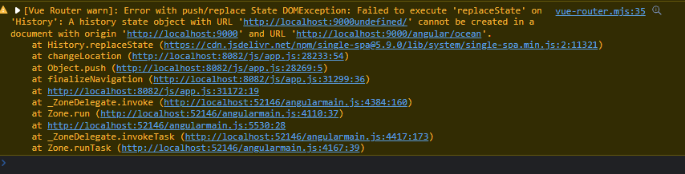

# Quickstart

Start the angular app:

```shell
cd angular-app 
npm install
npm run serve:single-spa:angular-app
```


Start the vue app:

```shell
cd vue-app
npm install
npm run serve
```

Start the single-spa root app:

```shell
cd root
npm install
npm run start
```

# Description

This repository was created to reproduce the error:



It includes 3 applications:

- angular
- vue 
- single-spa 

# How to reproduce

1. Navigate to http://localhost:9000/
2. Click on angular
3. Click on vue - triggers the error in the console
4. Click on Welcome - angular router still works
5. Click on Ocean - angular router still works


